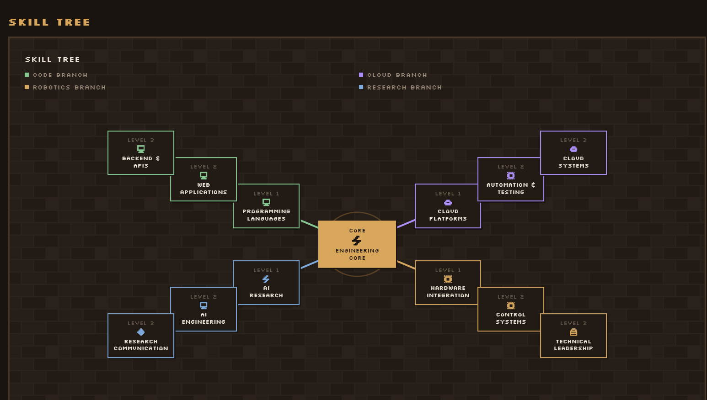
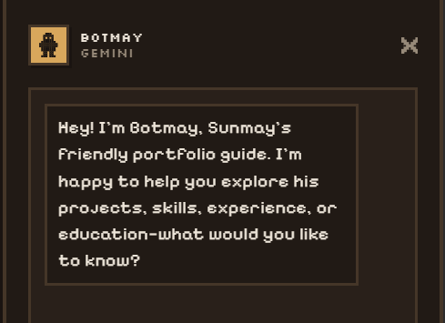
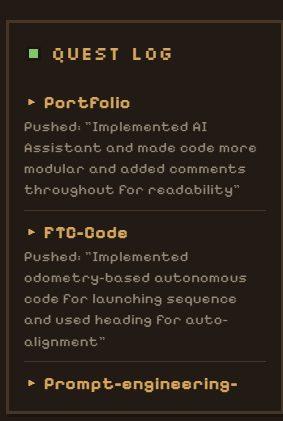

<div align="center">
  

# Sunmay Padiyar Portfolio

  <p><strong>A game-inspired software engineering portfolio with projects, experience, skills, and an AI companion.</strong></p>
</div>

A game-inspired software engineering portfolio built with React, Vite, and a Cloudflare Worker-backed AI companion named Botmay.

The site is meant to feel playful, but the codebase is organized like a maintainable frontend project: portfolio content lives in data files, external requests live in services, browser state lives in hooks, and reusable UI pieces live in focused component folders.

<p align="center">
  
</p>

<table>
  <tr>
    <td width="58%" align="center">
      
      <br />
      <sub><strong>Meet Botmay</strong> — an AI guide that helps visitors explore the portfolio.</sub>
    </td>
    <td width="42%" align="center">
      
      <br />
      <sub><strong>Follow the Quest Log</strong> — recent GitHub work presented in-world.</sub>
    </td>
  </tr>
</table>

## What this includes

- Character profile with resume-backed bio, achievement progress, and a final reward chest.
- Trophy Case for projects.
- Guild Hall for internships, research, robotics, and other experience.
- Skill Tree for technical skills and coursework.
- Quest Mail contact flow through Formspree.
- Quest Log with recent GitHub activity.
- Hidden Dungeon for the robotics engineering portfolio PDF.
- Botmay, a Gemini-powered portfolio companion served through a Cloudflare Worker.
- Persistent settings for theme, sound, readable font mode, and font size.

## Tech stack

- React 18
- Vite
- Vitest and Testing Library
- Node test runner for pure utility and Worker tests
- Cloudflare Workers for the assistant backend
- Formspree for contact form delivery

## Prerequisites

- Node.js 20 or newer is recommended.
- npm
- A Gemini API key, only if you want Botmay to answer locally or in production.
- A Formspree endpoint, only if you want the contact form to send messages.

## Quick start

Install dependencies:

```bash
npm install
```

Create local frontend environment variables:

```bash
copy .env.example .env.local
```

Start the frontend:

```bash
npm run dev
```

The portfolio will still run if Botmay is unavailable. To connect Botmay locally, start the Worker in a second terminal:

```bash
npm run dev:botmay
```

This uses a Node local adapter so Windows development does not depend on Cloudflare's `workerd` binary. Then set `VITE_AI_ASSISTANT_URL` in `.env.local`.

Production uses the public Botmay fallback in `src/config/assistant.js`, so the static-assets website does not need a runtime variable for `VITE_AI_ASSISTANT_URL`.

## Environment variables

### Frontend

Create `.env.local` from `.env.example`:

```env
VITE_AI_ASSISTANT_URL=http://127.0.0.1:8787
```

Only public values may use the `VITE_` prefix because Vite exposes those values to the browser bundle.

### Worker

Create `worker/.dev.vars` from `worker/.dev.vars.example`:

```env
GEMINI_API_KEY=your-local-key
ALLOWED_ORIGIN=http://localhost:5173
```

Never put the Gemini API key in `.env.local`.

See [worker/README.md](worker/README.md) for full Worker setup and deployment.

## Available scripts

```bash
npm run dev
```

Runs the Vite development server.

```bash
npm run dev:botmay
```

Runs the local Cloudflare Worker for Botmay at `http://127.0.0.1:8787`.

```bash
npm run dev:botmay:wrangler
```

Runs the same Worker through Wrangler. Use this when you specifically want to test Cloudflare's local runtime.

```bash
npm run build
```

Builds the production frontend into `dist/`.

```bash
npm run preview
```

Serves the production build locally.

```bash
npm run lint
```

Runs ESLint across the project.

```bash
npm test
```

Runs Node unit tests and Vitest component tests.

```bash
npm run check
```

Runs linting, all tests, and a production build. Use this before handing off changes.

```bash
npm audit --audit-level=moderate
```

Checks dependencies for moderate-or-higher security advisories.

## Project structure

```text
portfolio-project/
|-- docs/             # Project conventions and design-system notes
|-- large-assets/     # Oversized media linked from GitHub raw, not bundled into Cloudflare assets
|-- public/           # Static images, PDFs, favicon, and other browser assets
|-- scripts/          # Legacy helper scripts; not part of the normal workflow
|-- src/              # Active React application
|-- tests/            # Node tests for shared frontend utilities/services
|-- worker/           # Cloudflare Worker for Botmay
|-- index.html        # Vite HTML entry and metadata
|-- package.json      # npm scripts and dependencies
`-- vite.config.js    # Vite and test configuration
```

## Source layout

```text
src/
|-- components/
|   |-- assistant/    # Botmay chat panel
|   |-- contact/      # Mailbox, letters, and contact form
|   |-- dungeon/      # Hidden Dungeon journal/PDF area
|   |-- experience/   # Guild Hall
|   |-- games/        # Reserved game-vault code
|   |-- layout/       # App shell, sidebar, header/status, panels
|   |-- profile/      # Character sheet and reward chest
|   |-- projects/     # Trophy Case
|   |-- settings/     # Settings and achievements
|   |-- skills/       # Skill Tree
|   `-- ui/           # Reusable frames, icons, modals, media, sprites, toasts
|-- constants/        # Shared layout/design constants
|-- data/             # Portfolio content, themes, nav, mail, achievements
|-- hooks/            # Stateful browser behavior
|-- services/         # External request boundaries
|-- utils/            # Pure calculations and helpers
|-- App.jsx           # Top-level app state and orchestration
|-- index.css         # Global CSS and accessibility defaults
`-- main.jsx          # React entry point
```

New live UI work should go in `src/components/`, not `src/views/`. The `src/views/` folder is an archive of old snapshots and is intentionally ignored by ESLint.

## Where to change common things

- Portfolio copy: `src/data/`
- Theme colors: `src/data/themes.js`
- Navigation labels/icons: `src/data/nav.js`
- Achievement definitions: `src/data/achievements.js`
- Character profile: `src/components/profile/CharacterSheet.jsx`
- Project cards: `src/data/projects.js`
- Guild Hall experiences: `src/data/quests.js`
- Botmay frontend endpoint fallback: `src/config/assistant.js`
- Botmay knowledge: `worker/src/systemPrompt.js`
- Assistant network call: `src/services/assistantClient.js`
- Worker request handling: `worker/src/index.js`

## Architecture notes

The app is intentionally a single-page Vite application. A router is not used because every section is controlled by the same game-like shell and shared persistent state.

The main boundaries are:

- Components render UI and call callbacks.
- Hooks own browser state, persistence, timers, audio, GitHub activity, and progression.
- Services own external requests from the browser.
- Data files are the source of truth for portfolio content.
- The Worker owns Gemini access, CORS checks, rate limiting, request validation, and Botmay’s verified knowledge.

This keeps secrets server-side and keeps visual components from becoming network or business-logic dumping grounds.

## Testing strategy

The project has two test layers:

- `tests/*.test.js` and `worker/test/*.test.js` use Node’s test runner for pure functions, request helpers, Worker behavior, and service logic.
- Component tests use Vitest and Testing Library beside the relevant components.

Before sending changes, run:

```bash
npm run check
```

## Security notes

- Do not commit `.env.local`, `worker/.dev.vars`, API keys, or secrets.
- Do not put private values in `VITE_*` variables.
- Keep Gemini calls in the Worker so the browser never receives the API key.
- The Worker validates origin, method, content type, request body, and rate-limit state before calling Gemini.
- Botmay renders text as React elements, not raw HTML.
- External links should use `rel="noopener noreferrer"` when opened in a new tab.

## Deployment overview

Cloudflare Workers static assets have a 25 MiB per-file limit. Keep oversized media out of `public/`; files in `public/` are copied into `dist/` and uploaded as Worker assets. This repo keeps larger artifacts in `large-assets/` and links to them through GitHub raw URLs.

1. Build the frontend:

   ```bash
   npm run build
   ```

2. Deploy the frontend to your static host or through Cloudflare assets.
3. Deploy the Worker from `worker/`.
4. Set the deployed Worker URL as `VITE_AI_ASSISTANT_URL` in the frontend host environment.
5. Set `GEMINI_API_KEY` as a Cloudflare Worker secret.
6. Set `ALLOWED_ORIGIN` to the deployed portfolio origin.

## Additional docs

- [docs/STYLE_GUIDE.md](docs/STYLE_GUIDE.md) explains naming, folders, design tokens, UI rules, and validation.
- [worker/README.md](worker/README.md) explains Botmay’s backend setup.
- [src/views/README.md](src/views/README.md) explains the archived snapshot folder.
- [scripts/README.md](scripts/README.md) explains the legacy scripts folder.
